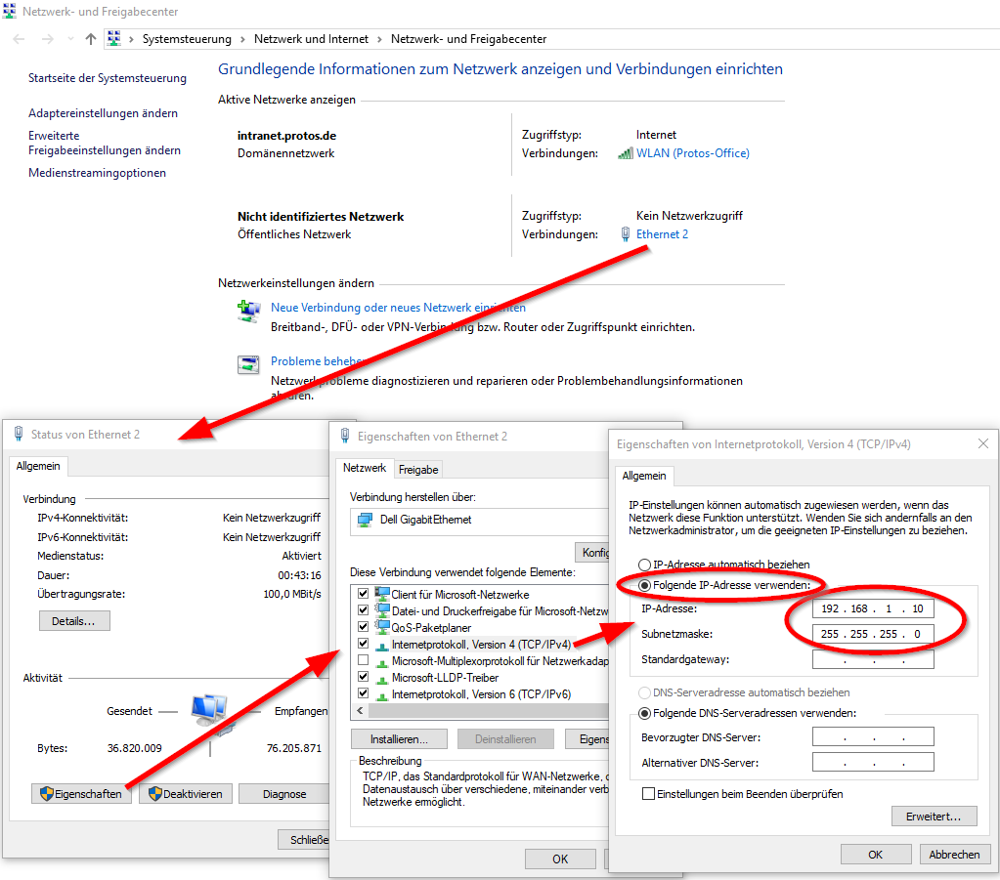
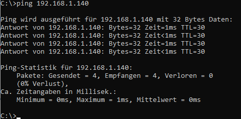

= HowTo for Modbus Library jamod 

== Commissioning Modbus Coupler
* Connect Mdbus Coupler with a RJ 45 cable to your computer
* Configure your Ethernet interface to a static IP-Address in the same IP-Range as the modbus coupler (no DHCP). Example:
** IP-Address of the modbus coupler: 192.168.1.140
** Your static IP-Configuration: 
*** IP-Address: 192.168.1.10
*** Subnetmask: 255.255.255.0

* Ping the modbus coupler from your commandline:

